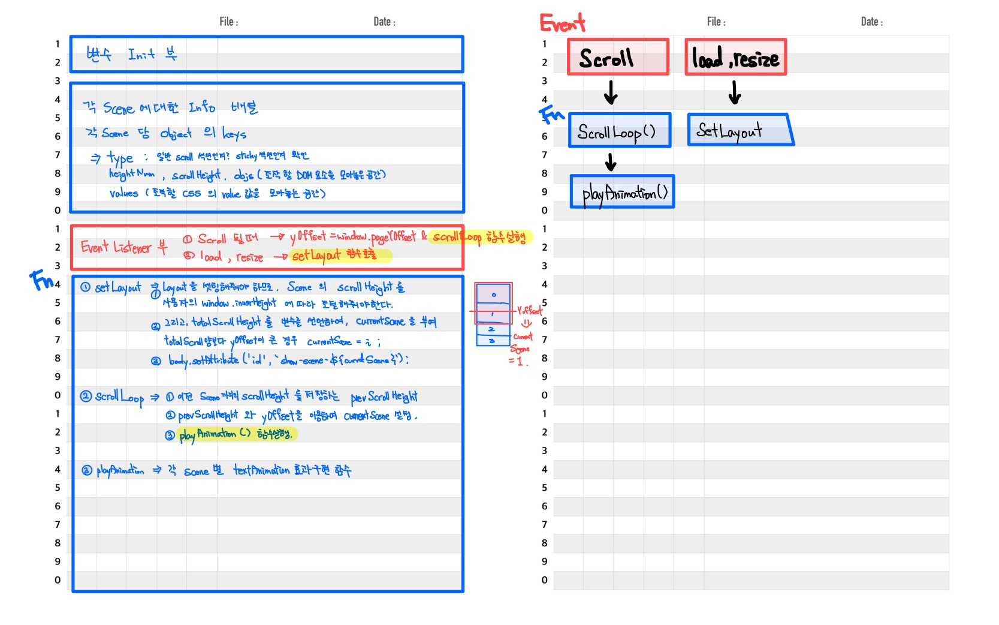

# apple-clone

## 1. HTML, CSS 등 기본 골격 만들기

| Class,ID-Name          | Desc                                                    |
| ---------------------- | ------------------------------------------------------- |
| `.sticky-elem`         | 눈앞에 붙어있는 element 요소 Control                    |
| `#scroll-section-#{$}` | 각 section 구분 id (section 별 interaction 이 다르므로) |
| `.pin`                 | `.desc-message` 에 붙어다니는 pin                       |

##  

## 2. Scroll Interaction

> 무엇을 배우는가? (학습목표)
>
> > `EventListener` Scroll , load , resize 에 대응 하는 함수 구현

> Concept

1. 각 Scene 에 대한 정보를 담는 배열 생성 => `sceneInfo[]`
2. 각 Scene 마다의 info Object 생성
3. 전체 레이아웃을 잡아주는 `SetLayout` 함수 만들기

   - **주기능** : 사용자의 **window.height** 에 따라 **각 Scene 의 scrollHeight 조절**
   - **부기능** : 사용자가 어디서 **새로고침(`load`)** 을 하더라도, 버그가 걸리지 않게끔, **`currentScene` 조절**

4. 사용자의 scroll 에 반응하는 `ScrollLoop` 함수 만들기

   - **주기능** : 사용자의 **`scroll`** 에 대응

5. 사용자의 scroll 에 반응하는 `playAnimation` 함수 만들기 (`ScrollLoop`의 자식 함수)
   - **주기능** : 사용자의 **`scroll`** 에 대응하여 각 Scene별 Animation 효과 구현

 

### function 상관관계

##  

## 3. High Definition Video Interaction

> 무엇을 배우는가? (학습목표)
>
> >

##  
